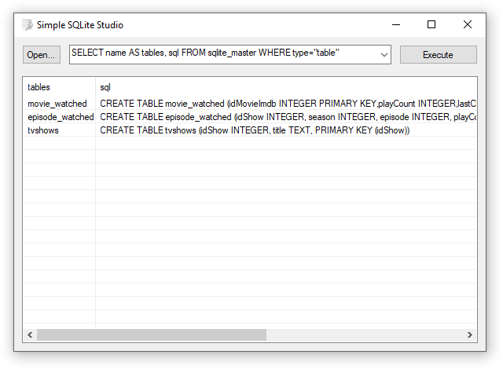

# Simple-SQLite-Studio

Simple user-interface to administrate SQLite-databases for Windows.

Supports all SQL-statements like SELECT, INSERT, UPDATE, DELETE, REPLACE, CREATE, DROP, ..., see www.sqlite.org.

To create a new SQLite-database just create a new empty text-file.

## Download
Windows:  (701 KB)

## License and Copyright
This software is Copyright (c) 2017 by alexgit2k.

This is free software, licensed under MIT License.
